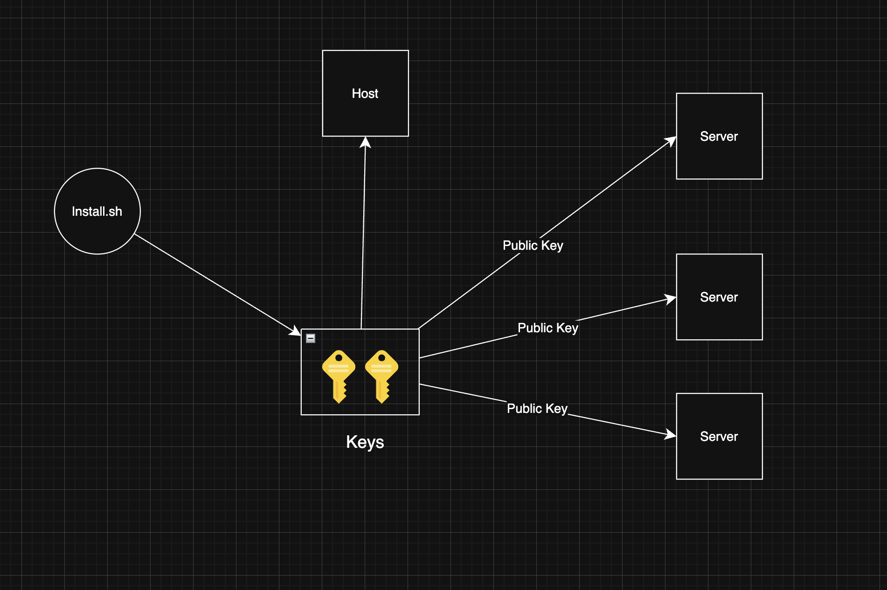
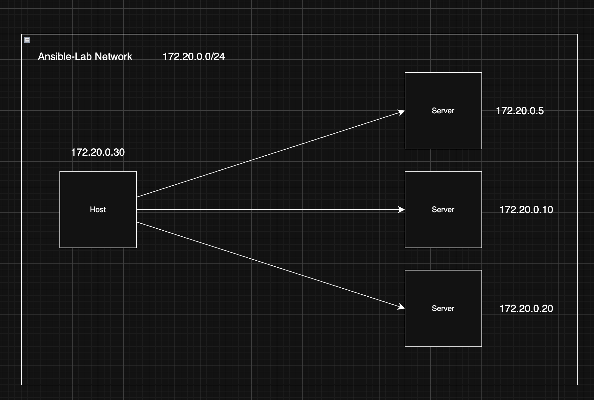

# Ansible Multi-Tier Infrastructure Lab

A simulated multi-tier infrastructure environment built using Docker containers and automated with Ansible.
This project demonstrates how configuration management tools can be used to provision and manage infrastructure components such as load balancers, web servers, and databases in a controlled lab environment.
The lab replicates a simplified production-style architecture while running entirely on a single machine.

## Architecture Overview

The system simulates a layered infrastructure environment.





```text
                 +--------------------+
                 |    Ansible Host    |
                 |    Control Node    |
                 +----------+---------+
                            |
                     SSH / Automation
                            |
          +-----------------+-----------------+
          |                                   |
          v                                   v
+-------------------+               +-------------------+
|     server_2      |-------------->|     server_3      |
| Load Balancer(80) |               |  App Server(8080) |
+---------+---------+               +---------+---------+
          |                                   |
          |                                   |
          +-----------------+-----------------+
                            |
                            v
                  +-------------------+
                  |     server_1      |
                  |  Database (5432)  |
                  +-------------------+
```

## Infrastructure Layers

### Control Layer

The Ansible control node (`host`) manages and configures all infrastructure components via SSH.

### Load Balancer Layer (`server_2`)

Distributes incoming requests to backend services (exposes port 80).

### Application Layer (`server_3`)

Handles application logic and processes client requests (exposes port 8080).

### Database Layer (`server_1`)

Stores application data and provides backend persistence (exposes port 5432).

## Project Structure

```bash
ansible-lab
│
├── assets/             # Architecture diagrams and visuals
│
├── keys/               # Generated SSH keys for cluster auth
│
├── host
│   └── Dockerfile
│
├── server_1
│   └── Dockerfile
│
├── server_2
│   └── Dockerfile
│
├── server_3
│   └── Dockerfile
│
├── ansible-lab.sh
├── docker-compose.yml
├── howto.md
├── SECURITY.md
├── ACKNOWLEDGEMENT.md
└── README.md
```

## Component Description

### `host`

Acts as the Ansible control node responsible for running automation playbooks and managing the environment. Runs with IP `172.20.0.30`.

### `server_1` (Database)

Database service intended for backend persistence, simulating a service like PostgreSQL. Exposes ports 22 and 5432. Runs with IP `172.20.0.10` (Key-based SSH login).

### `server_2` (Load Balancer / Web)

Represents the traffic routing layer responsible for distributing incoming requests. Exposes ports 22 and 80. Runs with IP `172.20.0.20` (Key-based SSH login).

### `server_3` (Application Server)

Application server responsible for handling requests and communicating with the database. Exposes ports 22 and 8080. Runs with IP `172.20.0.5` (Key-based SSH login).

### `docker-compose.yml`

Defines and orchestrates the multi-container infrastructure environment with a custom bridge network assigning static IPs to each container.

### `ansible-lab.sh`

A unified CLI wrapper script intended to automate the environment. Includes commands to `init` (install dependencies and generate SSH keys), `start`, `stop`, `clean`, and check `status`.

## Technologies Used

| Technology         | Purpose                                                |
| ------------------ | ------------------------------------------------------ |
| **Docker**         | Containerized infrastructure simulation                |
| **Docker Compose** | Multi-container orchestration                          |
| **Ansible**        | Infrastructure automation and configuration management |
| **Linux (Debian)** | Base operating system                                  |
| **SSH**            | Remote automation and configuration                    |

## What This Project Demonstrates

This lab demonstrates several important DevOps and Infrastructure Engineering concepts:

- Infrastructure automation using Ansible
- Multi-tier architecture design
- Containerized infrastructure environments
- Configuration management workflows
- Infrastructure simulation for safe experimentation

## Why This Project Was Built

Testing automation tools such as Ansible often requires multiple servers.
This lab provides a safe and reproducible environment where infrastructure automation can be practiced without needing multiple physical or cloud machines.
By simulating infrastructure using Docker containers, the project allows experimentation with:

- Configuration management
- Service orchestration
- Infrastructure provisioning
- Network communication between services

## How to Run the Lab

Clone the repository:

```bash
git clone https://github.com/anubhavbuildz/ansible-lab.git
cd ansible-lab
```

Build and start the infrastructure:

```bash
./ansible-lab.sh init
./ansible-lab.sh start
```

Docker will build all service containers and start the infrastructure environment.

## Key Learning Outcomes

Through this project I practiced:

- Designing multi-tier infrastructure
- Using Ansible for automation
- Simulating infrastructure using containers
- Managing service dependencies
- Understanding infrastructure communication patterns

## Possible Future Improvements

Potential improvements to extend this lab:

- Add multiple web servers for load balancing
- Implement Nginx reverse proxy configuration
- Integrate monitoring tools (Prometheus, Grafana)
- Add CI/CD automation pipelines
- Deploy the architecture on Kubernetes

## Author

**Anubhav Sharma**  
Cloud • DevOps • Systems Engineering
